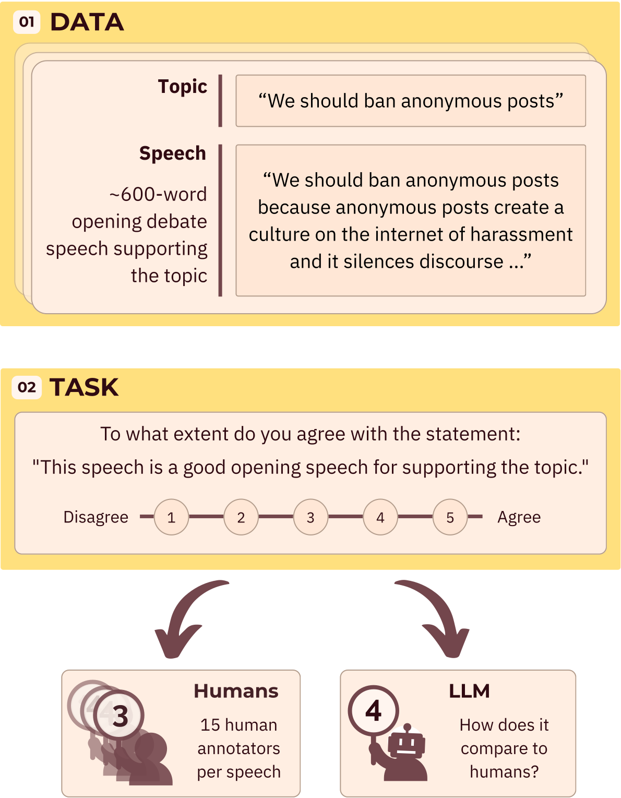

[](https://put-here-your-paper.com)
[](https://www.python.org/)

## LLM on Trial: Benchmarking LLM-as-a-Judge via Argumentation

As LLM judges grow in popularity, evaluating their performance on cognitively challenging tasks becomes crucial. We
propose using debate speech evaluation as a new benchmarking task for LLM judges. To support this, we leverage a unique
dataset of 631 debate speeches, carefully rated by multiple human annotators. Through this dataset, we examine how
well current state-of-the-art models perform on this complex task.
<p align="center">
  
</p>

## Table of Contents

<!-- TOC -->
  * [Getting started](#getting-started)
    * [Setting up API keys](#setting-up-api-keys)
  * [Data](#data)
  * [Reproducing paper results](#reproducing-paper-results)
    * [Run judges](#run-judges)
    * [Analysis](#analysis)
    * [Speech generation](#speech-generation)
    * [Key point analysis](#key-point-analysis)
  * [Citation](#citation)
  * [Authors](#authors)
<!-- TOC -->

## Getting started

A quick start guide to get you up and running with the code.

1. Clone this repository:
    ```bash
    git clone https://github.com/noy-sternlicht/BenchmarkingLLMAJ.git
    ````
2. Create and activate a virtual environment:
   ```bash
   python3 -m venv myenv
   source ./myenv/bin/activate
   ```
3. Install dependencies:
   ```bash
   pip install -r requirements.txt
   ```

### Setting up API keys

Some of the code requires access to external APIs. You will need to set an OpenAI API key, an Anthropic key and a
HuggingFace API key as
follows:

1. Get the keys (if you don't have them already):
    * [OpenAI API key](https://platform.openai.com/docs/api-reference/authentication)
    * [Anthropic API key](https://docs.anthropic.com/en/api/admin-api/apikeys/get-api-key)
    * [HuggingFace API key](https://huggingface.co/docs/hub/security-tokens)
2. Set up the keys:
   ```bash
   mkdir secret_keys
   echo "your-openai-api-key" > secret_keys/openai_key
   echo "your-anthropic-api-key" > secret_keys/anthropic_key
   echo "your-huggingface-api-key" > secret_keys/huggingface_key
   ```
   The files specified in the above snippet (`secret_keys/***_key`) are the default locations where the code will look
   for the keys.

## Data

We use a subsection of 631 speeches from the [Project Debater](https://www.nature.com/articles/s41586-021-03215-w#citeas)
evaluation dataset. This section is available at `data.csv`. The file contains the following fields:

* `id`: The unique identifier for the speech.
* `topic_id`: The unique identifier for the topic.
* `topic`: The topic of the debate speech (e.g., "Community service should be mandatory").
* `source`: The speech source (e.g., "Human-expert" for human authored speeches).
* `text`: The text of the speech.
* `goodopeningspeech`: A list of human rating for the speech (a number between 1 and 5 for each annotator).
* `#labelers`: The number of human annotators who rated the speech.
* `labeler_ids`: A list of the unique identifiers for the human annotators who rated the speech.

## Reproducing paper results

### Run judges

We use `scripts/run_judge_models.sh` to run a judge (or multiple judges) over the data. The script
receives a config file defining which models to run, what prompt to use, and so on. We provide an example at
`src/zero_shot_config.json`. You can modify it as follows:

   ```text
     {"data_path": "data.csv",  # Path to the human annotated speeches
     "output_path": "output/judges_results/", # Where to save the results
     "openai_key_path": "secret_keys/openai_key", # Default keys location
     "anthropic_key_path": "secret_keys/anthropic_key",
     "huggingface_key_path": "secret_keys/huggingface_key",
     "max_tokens": 4096,  # Max input + output tokens
     "temperature": 0.01,  # Judge temperature
     "experiments": [
       {
         "name": "zero-shot-good-speech-guidelines",   # No-CoT prompt
         "prompt_path": "./prompts/zero_shot_good_speech_annotation_guidelines.txt",
         "human_annotations_data_field": "goodopeningspeech", # Field containing the human annotations
         "run": true    # Run models using this prompt
       },
       {
         "name": "zero-shot-good-speech-guidelines-short-cot",   # CoT prompt
         "prompt_path": "./prompts/zero_shot_good_speech_annotations_guidelines_short_cot.txt",
         "human_annotations_data_field": "goodopeningspeech",
         "run": true    
       }
     ],
     "models": { # Which models to run (divided by required key). For example, listing "openai" under "participating_models" will run the specified openai models.
       "openai": [
         "o3"
       ],
       "huggingface": [
         "Qwen/Qwen2.5-72B-Instruct"
       ],
       "anthropic": [
         "claude-3-7-sonnet-20250219"
       ]
     },
     "participating_models": [
       "anthropic"
     ]}
   ```

### Analysis

1. **List judges info**: Our analysis scripts receive a json file specifying what judges to evaluate. The file should be
   structured as
   follows:
   ```text
   {
     "eval_models": [
       {
         "name": "<judge_name>",   # For example, "o3" or "Judge-1"
               "results": {
            "<key_type>_<model_name>": "<results path>" # key_type can be "openai", "anthropic" or "huggingface"
                }
        }
     ]
   }
   ```
   We provide an example at `src/judges_results.json`. You can define **a judge ensemble** as follows:
    ```text
    {
      "eval_models": [
         {
            "name": "ensemble_1 (o3 + gpt-4.1-mini + Qwen2.5-32B-Instruct)",
            "results": {
              "openai_o3": "output/o3",   # ensemble model 1
              "openai_gpt-4.1-mini": "output/gpt-4.1", # ensemble model 2
              "huggingface_Qwen/Qwen2.5-32B-Instruct": "output/zero_shot_qwen_32b" # ensemble model 3
              ...
            }
         }
      ]
    }
    ```
2. **Run pairwise agreement analysis (Kappa)**: Run `scripts/analyse_pairwise_agreement.sh`. You can modify the script
   parameters as follows:

   ```bash
   python3 src/analyse_pairwise_agreement.py \
   --eval_models_config src/judges_results.json \  # The json file specifying the judges to evaluate
   --data_path data.csv \
   --output_dir pairwise_agreement_results \  # Where to save the results
   --min_shared_annotations 50 \   # Minimum number of shared annotations between judges, referred to as "minimum-sample" in the paper
   --prompt 'zero-shot-good-speech-guidelines'  # The prompt used to generate the results. 'zero-shot-good-speech-guidelines' for the no-CoT experiment, 'zero-shot-good-speech-guidelines-short-cot' for the CoT experiment 
   ```
3. **Run agreement with mean human rating (Tau)**:  Run `scripts/analyse_agreement_with_mean.sh`. You can adjust the
   script parameters as follows:
    ```bash
   python3 src/analyse_agreement_with_mean.py \
   --eval_models_config src/judges_results.json \ # The json file specifying the judges to evaluate
   --output_path eval_results \ # Where to save the results
   --data_path data.csv \
   --prompt 'zero-shot-good-speech-guidelines-short-cot'  # The prompt used to generate the results. 'zero-shot-good-speech-guidelines' for the no-CoT experiment, 'zero-shot-good-speech-guidelines-short-cot' for the CoT experiment.
    ```
4. **Run score distribution analysis**: Run `scripts/analyse_scores_distribution.sh`
5. **Run speech source analysis**: Run `scripts/run_source_analysis.sh`.

### Speech generation

To generate speeches using GPT-4.1, run `scripts/generate_speeches.sh`. The script receives a json
file `src/generate_speeches_config.json` defining the used parameters (e.g., temperature, maximum speech length...),
which you can customize. `GPT_4_1_speeches.csv` contains the 152 generated speeches we analyze in the paper. You could
use our inference scripts (described [here](#run-judges)) to run the judges over the speeches.

### Key point analysis

As specified in the paper, we first rephrase CoT explanations by the judges as paragraphs of shorter sentences. To run
this step, execute `scripts/preprocess_key_point_analysis.sh`. The python script it runs receives the following
parameters:

```bash
python3  src/point_analysis_preprocessing.py \
 --judges_results src/models_for_keypoint_analysis.json \  # The json file specifying the judges to evaluate
 --output_path point_analysis_preprocessing \  # Where to save the results
 --prompt 'zero-shot-good-speech-guidelines-short-cot' \ # The prompt used to generate the results. 'zero-shot-good-speech-guidelines' for the no-CoT experiment, 'zero-shot-good-speech-guidelines-short-cot' for the CoT experiment
 --openai_api_key secret_keys/openai_key \ # The path to the OpenAI API key
 --preprocessing_prompt 'prompts/preprocess_reasoning.txt' \ # Perprocessing prompt
 --model_name gpt-4.1 # Preprocessing model (should be an OpenAI model)
```

We next run the key-point analysis using watsonx.ai, and provide out output in `keypoints.csv`. `scripts/run_kpa.sh`
runs the analysis we report in the paper.

## Citation

If you use this code or data in your research, please cite our paper:

```bibtex
@article{author2025paper,
  title={Paper Title},
  author={Last, First and Coauthor, Another},
  journal={Journal Name},
  volume={X},
  number={Y},
  pages={ZZ--ZZ},
  year={2025},
  publisher={Publisher}
}
```

## Authors

* [Noy Sternlicht](https://x.com/NoySternlicht)
* [Ariel Gera](https://scholar.google.com/citations?user=ESCkne8AAAAJ&hl=en)
* [Roy Bar-Haim](https://research.ibm.com/people/roy-bar-haim)
* [Tom Hope](https://tomhoper.github.io/)
* [Noam Slonim](https://research.ibm.com/people/noam-slonim)